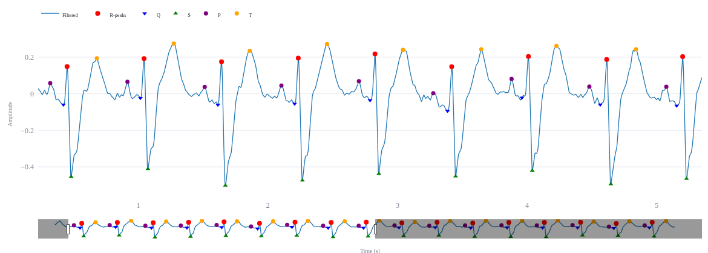
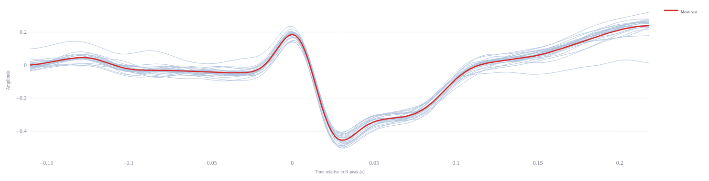

# ECG Signal Processing Pipeline

A simple Streamlit app for a full single-lead ECG pipeline: bandpass + notch
filtering, Pan-Tompkins QRS detection, beat segmentation, and time-
and frequency-domain HRV feature extraction.

## **Standard Pipeline**

### 1. Data acquisition

Raw ECG typically at a sampling frequency in the range 250–1000 Hz.

Three ways to feed it a signal:
- **Synthetic** — simulate a 12-lead ECG with `neurokit2`, with adjustable
  heart rate, noise, powerline interference, and baseline wander.
- **WFDB** — upload a matching `.hea` + `.mat`/`.dat` record pair.
- **CSV** — upload any CSV with a signal column (and optionally a time column).

### 2. Preprocessing

- **Bandpass filter** — low-pass and high-pass filter included (0.5–40 Hz for general use; wider if you need pacing spikes or detailed morphology).
- **Powerline interference** — 50/60 Hz notch filter.

### 3. QRS detection and R-peak refinement 

**Pan-Tompkins**:
Bandpass filter → derivative (emphasize slope) → square (nonlinear amplification) → moving-window integration → adaptive thresholding to find R-peaks.

**Peak refinement**: snap each detected peak to the true local max in the raw signal

### 4. Beat segmentation

Segment each beat into a fixed window around R for morphology analysis.

### 5. Feature extraction
- `heart_rate_bpm`: average heart rate in bpm
- `mean_rr_ms`: average interval between consecutive R-peaks in ms, 
- `sdnn_ms`: standard deviation (sd) of normal-to-normal (nn) 

**Example of wave identification using the app**
- Detect P, Q, R, S, and T waves in the filter ECG signal. 
- Source file: `A0001.hea` + `A0001.mat` (in `data/Train_WFDB`) (sampling rate = 500 Hz)
- Lead to analyze: I
- Tuned QRS detection parameters:
  - Integration window size (s): 0.1
  - Min. distance between peaks (s): 0.2
  - Search radius (s): 0.15

- Beat segmentation:
  - Before R-peak (s): 0.16
  - After R-peak (s): 0.22

- Tuned wave delineation parameters:
  - Q search window before R (s): 0.05
  - S search window after R (s): 0.06
  - P search window before R (s): $(p_{\rm far}, p_{\rm near})=(0.2, 0.1) $
  - T search window after R (s): $(t_{\rm near}, p_{\rm far})=(0.15, 0.4) $

- Average QRS duration: $68 ms$ / Average heart rate: $100.5 bpm$
<center>


Figure 1. Filtered lead-I ECG signal with wave identification  

   

Figure 2. Shape of 25 segmented beats plus the average beat around R-peak.
</center>


## **Project layout**

```
signal__ecg_processing
├── data/                  # containing local data  
|
├── app.py                 # Streamlit UI
├── ecg_pipeline.py        # ECG signal processing pipeline
├── requirements.txt       
├── Dockerfile
├── docker-compose.yml
├── .dockerignore
├── .streamlit/
│   └── config.toml        # server + theme config
└── README.md
```


## Run with Docker (recommended)

```bash
docker compose up --build
```

Then open http://localhost:8501

To stop:

```bash
docker compose down
```

Or without compose:

```bash
docker build -t ecg-pipeline-app .
docker run --rm -p 8501:8501 ecg-pipeline-app
```

## Run locally without Docker

Python 3.12+ required.  
Run with virtual environment:

```bash
python -m venv .venv
source .venv/bin/activate   # Windows: .venv\Scripts\activate
pip install -r requirements.txt
streamlit run app.py
```

Then open http://localhost:8501

## Notes

- The Docker image runs as a non-root user and exposes a healthcheck at
  `/_stcore/health`.
- `.dockerignore`/`.gitignore` exclude local data files (.csv, .hea, .mat, .dat) so nobody accidentally bakes patient/test ECG records into a Docker image or git history. 

